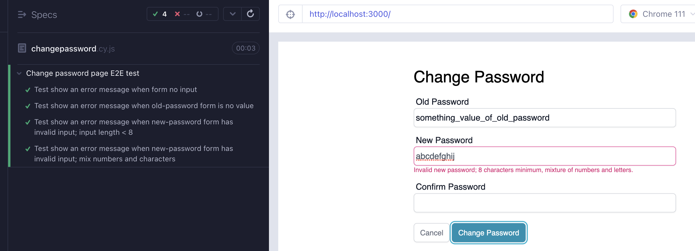

# Frontend Coding Challenge conclusion 

This project is a frontend coding assignment aimed at demonstrating my front-end development skills. The objective is to develop a change password page using React and TailwindCSS, and to create E2E tests using Cypress to ensure the functionality of the page.
## Live 
|Host|URL|
|---|---|
|Firebase|https://frontend-coding-challeng-9534d.web.app|
### Tasks
- [x] Using React Hooks Components
- [x] Using Cypress CI
- [x] ARIA semantics included
- [x] Form has validation 
- [x] Form has error messages 
- [x] UI support responsive
- [x] Validate old password required
- [x] Validate new password required
- [x] Validate new password min of 8 characters
- [x] Validate new password mixture of numbers and letters
### E2E test result screen shot
